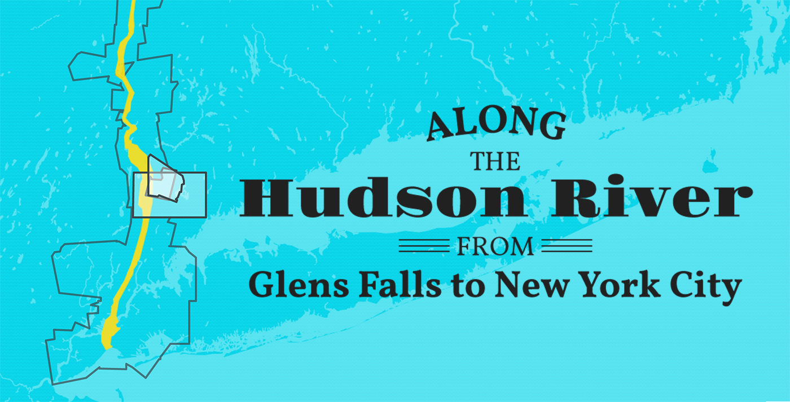

# Along the Hudson

http://bertspaan.nl/along-the-hudson

Maps along the Hudson river from the <a href="http://digitalcollections.nypl.org/">New York Public Library's Digital Collections</a>,  using data from the <a href="http://spacetime.nypl.org">NYC Space/Time Directory</a>.

Along the Hudson uses [Leaflet](http://leafletjs.com/), [RBush](https://github.com/mourner/rbush), [Turf](http://turfjs.org/) and [D3](https://d3js.org/).

## Data

[`data/all.geojson`](data/all.geojson) and [`data/grouped.geojson`](data/grouped.geojson) are created with [group-maps](https://github.com/nypl-spacetime/group-maps):

    spacetime-group-maps -c group-maps-config.json -g data/hudson.geojson -o data

[`data/hudson.geojson`](data/hudson.geojson) was hand-traced, which took way too long.
