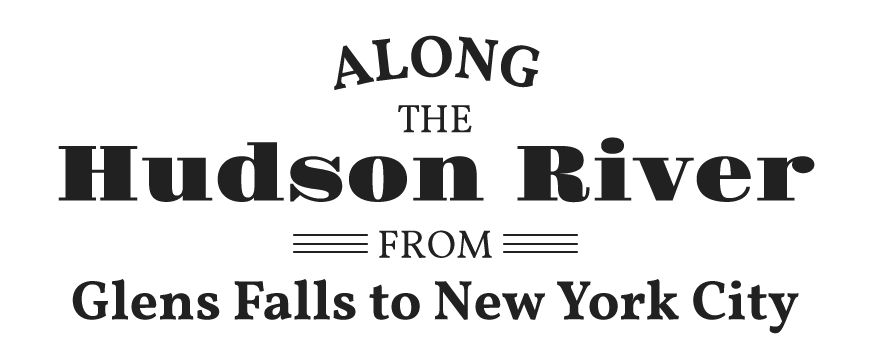

# Along the Hudson

http://bertspaan.nl/along-the-hudson

Along the Hudson uses [Leaflet](http://leafletjs.com/), [RBush](https://github.com/mourner/rbush), [Turf](http://turfjs.org/) and [D3](https://d3js.org/).

- doe vergrootglasje
- doe transities!
- set bbox voor leaflet

## group-maps

    spacetime-group-maps -c group-maps-config.json -g data/hudson.geojson -o data
